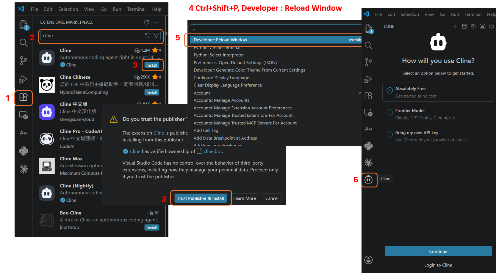
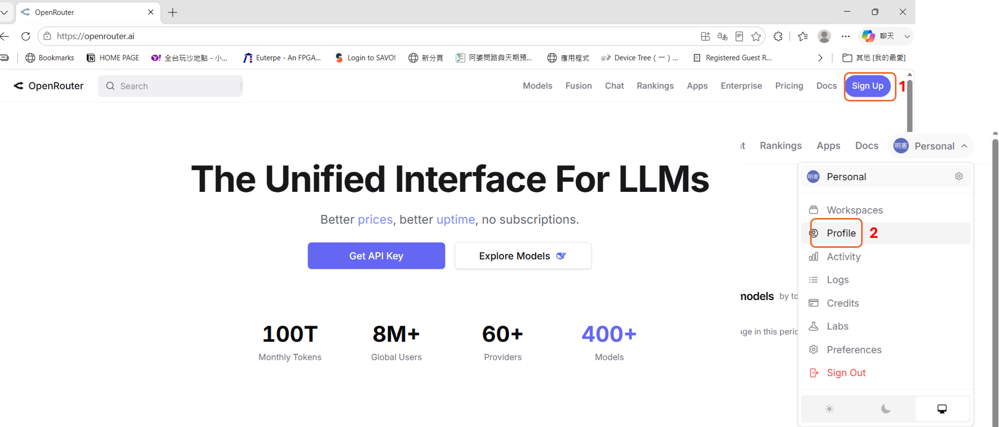
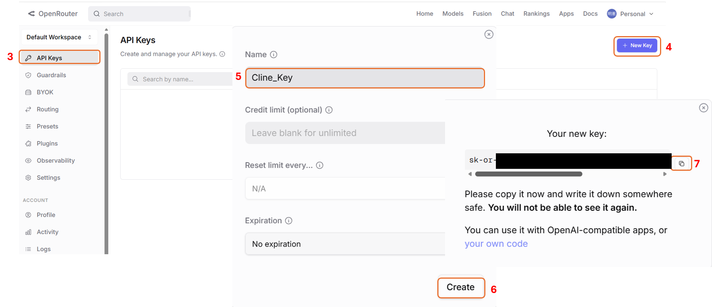
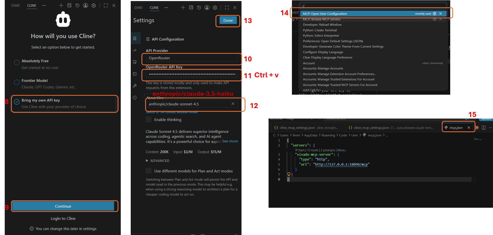
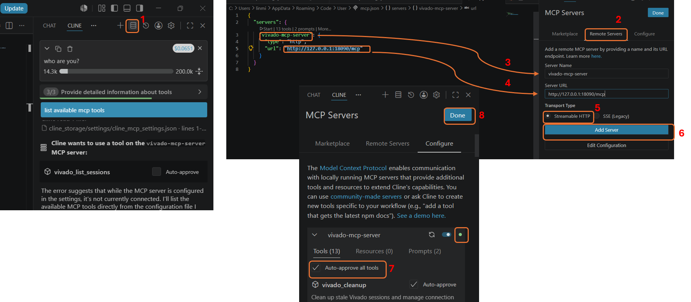
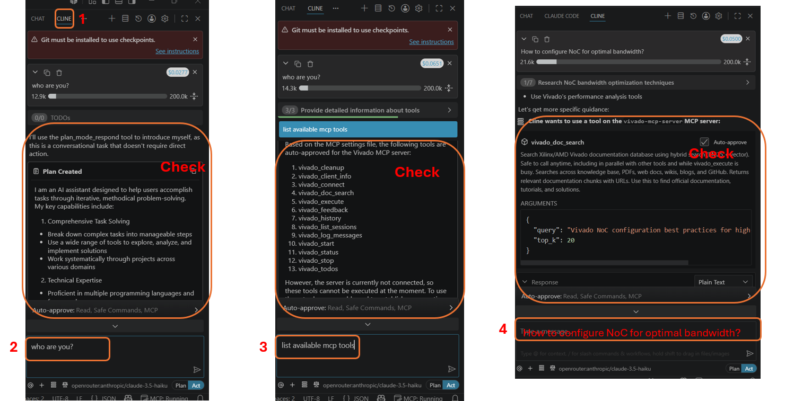

# Vivado AI Assistant Environment setup 
### Set up the Vivado AI Assistant toolchain in your Windows OS environment. Each guide walks you through installation, configuration, and a first test to verify everything works.
## Step 0 : Prerequisites
- Request access to the [AMD AI Assistant Early Access Secure Site](https://account.amd.com/en/member/vivado-ai-assistant-ea.html) and get an approval 
- Visual Studio Code + Github Copilot installed 
- Vivado 2025.2 installed
- Creating an account on GitHub (option for new user)
- Download related packages (Vivado AI Assistant Extension & Example Designs) from  [AMD AI Assistant Early Access Secure Site](https://account.amd.com/en/member/vivado-ai-assistant-ea.html)

## Step 1 :  Install the Vivado AI Assistant Extension
- Download vivado-ai-extension-0.6.8.zip from the [Downloads](https://account.amd.com/en/member/vivado-ai-assistant-ea/getting-started/downloads.html) page and unzip it
- Open VS Code
- Go to Extensions sidebar → click ⋯ → Install from VSIX...
- Select the downloaded .vsix file

## Step 2 : Configure Vivado Path (Vivado AI Extension & system environment)
After installing the extension, set the path to your Vivado executable:
- Open Settings (Ctrl+,)
- Search for Vivado Path
- Enter the full path to your Vivado binary (e.g.,C:\AMD\DesignTools\2025.2\Vivado\bin\vivado.bat )
- To set the Vivado environment variable PATH, add the Vivado bin directory (such as C:\Xilinx\Vivado\<version>\bin) to your system environment variables.

## Step 3 :  Setup and Enable MCP Server
- In Github Copilt Chat -> Configure Tools...
- Enable Vivado-mcp-server checkbox

## Step 4 :  Verify the Setup
- login Github Copilot
- In Github Copilot Chat -> prompt 
- In Github Copilot Chat, Type: "List the available MCP tools"
- In Github Copilot Chat, Type: "Start a Vivado session"
- In Github Copilot Chat, Type: "How to configure NoC for optimal bandwidth? please first use vivado_doc_search tool"

## Step 5 (option) :  Install the Claude Code Extension
- VS Code -> Extension -> Claude Code for VS Code
- Install
- Ctrl + Shift + p -> Developer: Reload Window
 
 

## Step 6 (option) :  Setting MCP Server for Claude code
- create a "mcp.json" in workspace
- edit mcp.json to enable 

## Step 7 (option) : Verify the Setup for Claude Code
- login Claude Code
- In Claude Code Chat -> prompt 
- In Claude Code Chat, Type: "List the available MCP tools"
- In Claude Code Chat, Type: "How to configure NoC for optimal bandwidth?"

## Step 8 (option) : Install the Cline with OpenRouter
- VS Code -> Extension -> Cline
- Install
- Ctrl + Shift + p -> Developer: Reload Window

## Step 9 (option) : Setup the Cline with OpenRouter
- Create an account at [openrouter.ai](https://openrouter.ai/)
- Add credits and generate an API key at [openrouter.ai/settings/keys](https://openrouter.ai/settings/keys)
- Configure your API key in [Cline](https://github.com/cline/cline?tab=readme-ov-file#use-any-api-and-model) — see their [OpenRouter integration guide](https://github.com/cline/cline?tab=readme-ov-file#use-any-api-and-model) for setup details

## Step 10 (option) : Vivado MCP Configuration with Cline
- Ctrl+Shift+P, Open mcp.jsom

## Step 11 (option) : Verify the Setup for Cline with OpenRouter
- In Claude Code Chat -> prompt 
- In Cline Chat, Type: "List the available MCP tools"
- In Cline Chat, Type: "How to configure NoC for optimal bandwidth?"

